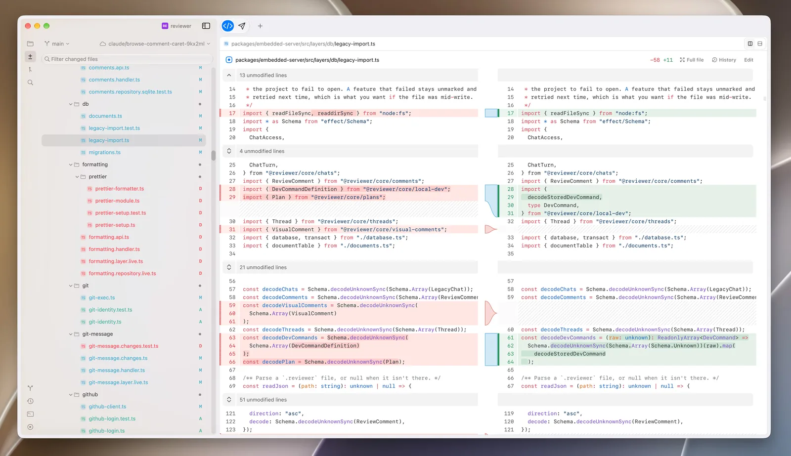
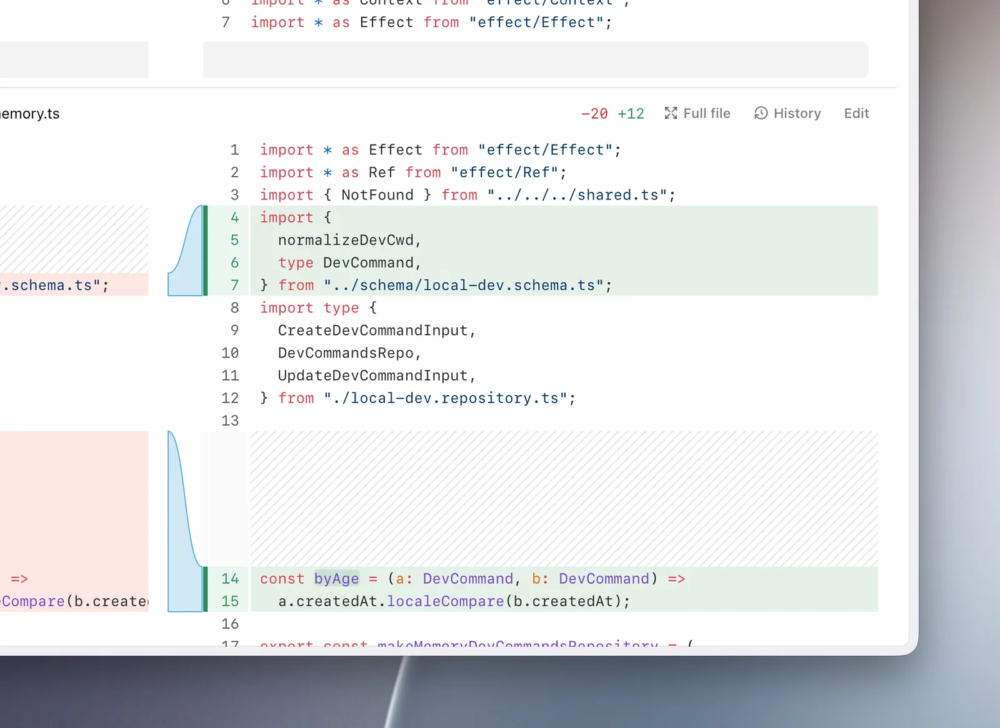
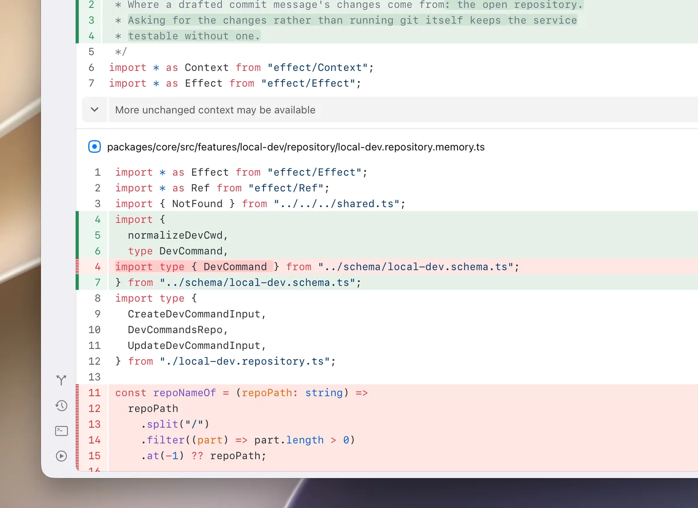
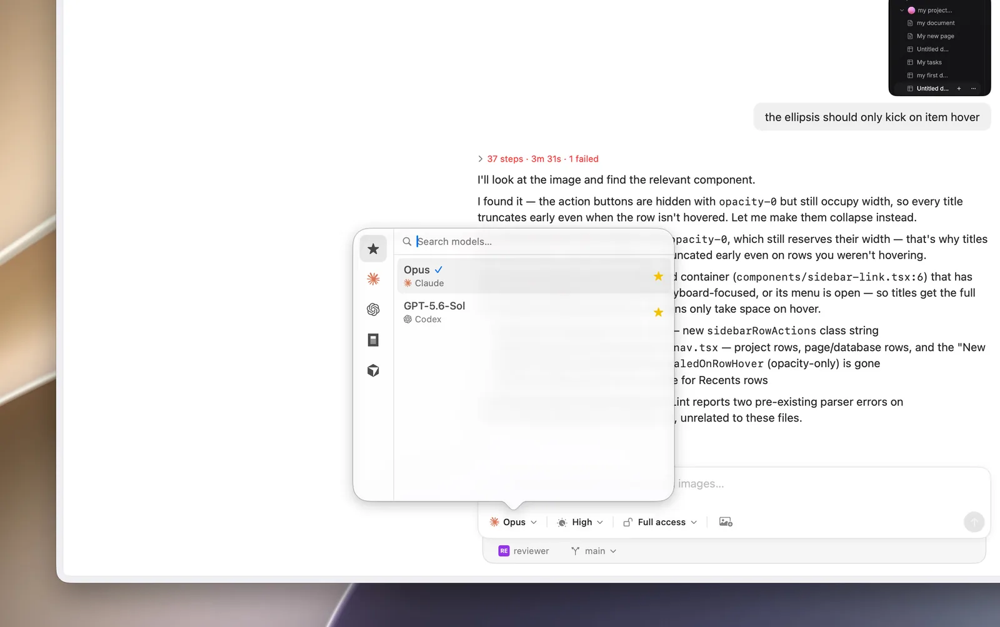
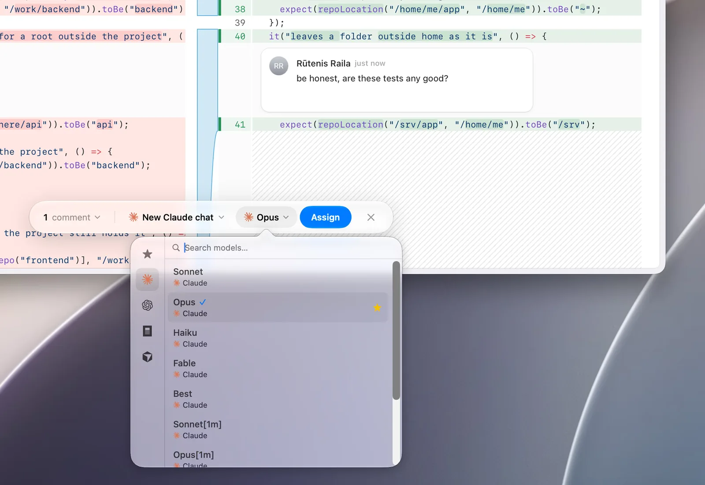
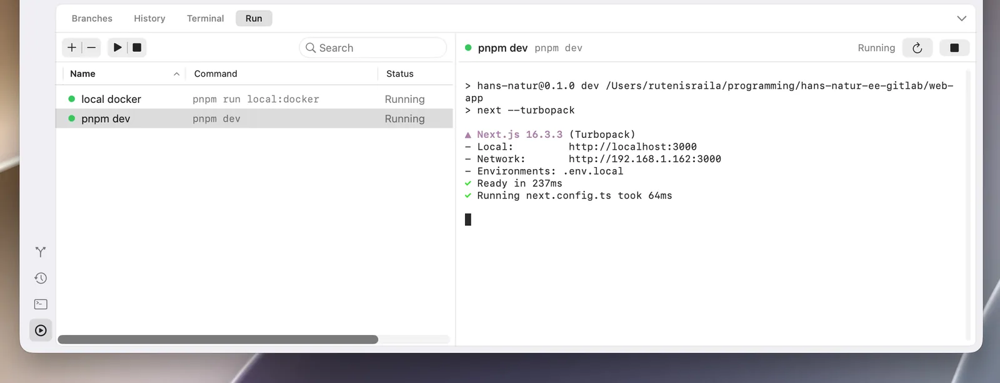
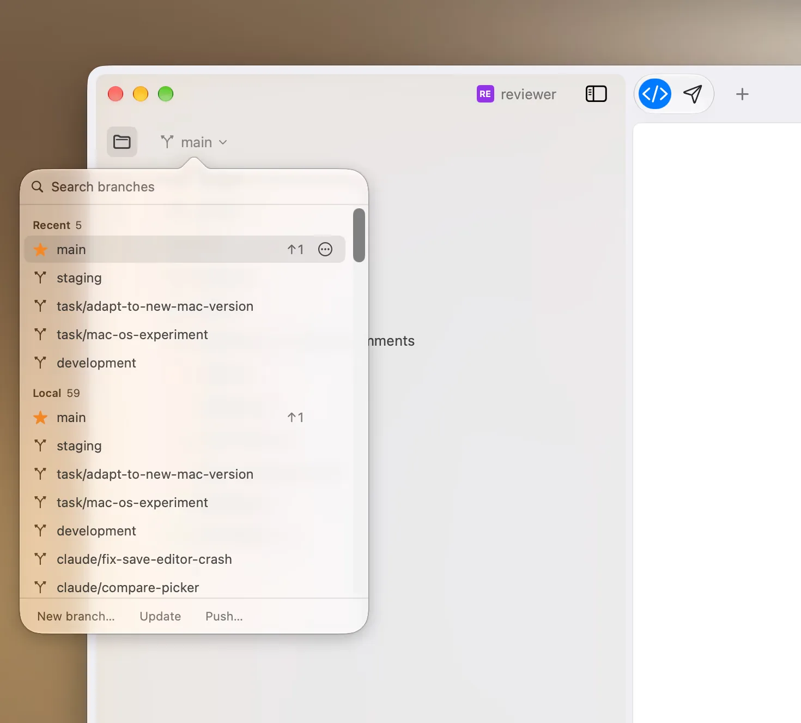
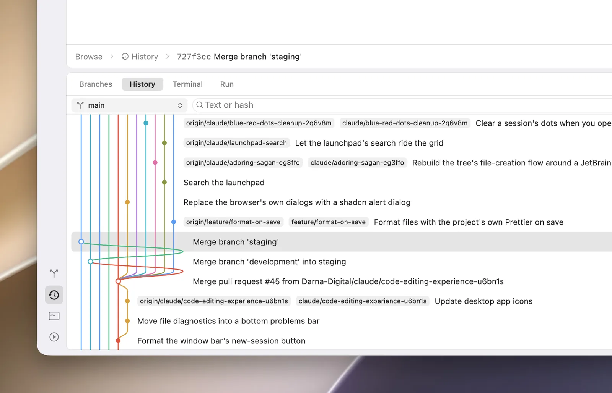
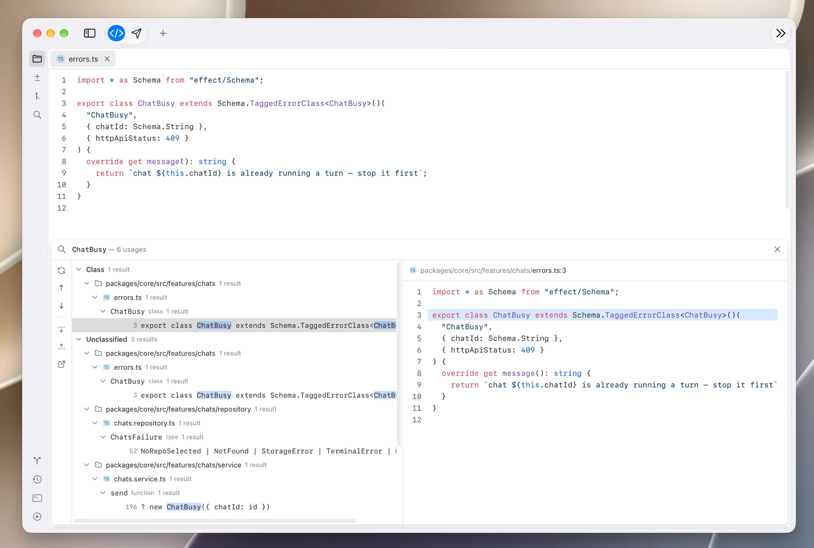

<div align="center">

<picture>
  <source media="(prefers-color-scheme: dark)" srcset="docs/icon-dark.svg">
  
</picture>

# Reviewer

**Understand AI-generated code.**

In a world where we no longer write code, we spend a lot more time reviewing it.<br>
Reviewer is a delightful, smooth macOS app built precisely for that.

[](https://github.com/Darna-Digital/reviewer/releases/latest)
[](https://github.com/Darna-Digital/reviewer/releases)
[](https://github.com/Darna-Digital/reviewer/actions/workflows/release.yml)
[](LICENSE)
<br>
[](https://reviewer.sh)
[](https://reviewer.sh)
[](packages/mac-os)
[](packages)
[](CONTRIBUTING.md)

[**Download for macOS**](https://github.com/Darna-Digital/reviewer/releases/latest) · [Website](https://reviewer.sh) · [Releases](https://github.com/Darna-Digital/reviewer/releases) · [Report a bug](https://github.com/Darna-Digital/reviewer/issues/new?template=bug_report.yml) · [Request a feature](https://github.com/Darna-Digital/reviewer/issues/new?template=feature_request.yml)

</div>

<br>

<picture>
  <source media="(prefers-color-scheme: dark)" srcset="docs/screenshots/split-diff-dark.webp">
  
</picture>

## Contents

- [Features](#features)
- [Install](#install)
- [Resolve review comments with any agent](#resolve-review-comments-with-any-agent)
- [Development](#development)
- [Contributing](#contributing)
- [License](#license)

## Features

### A diff viewer that reads the way you do

Lay the diff out side by side or top to bottom, whichever reads better for the
change in front of you. Click any file to open it on its own and read it whole.

<table>
  <tr>
    <th>Horizontal</th>
    <th>Vertical</th>
  </tr>
  <tr>
    <td width="50%">
      <picture>
        <source media="(prefers-color-scheme: dark)" srcset="docs/screenshots/diff-split-dark.webp">
        
      </picture>
    </td>
    <td width="50%">
      <picture>
        <source media="(prefers-color-scheme: dark)" srcset="docs/screenshots/diff-stacked-dark.webp">
        
      </picture>
    </td>
  </tr>
</table>

### Work with Claude Code and Codex from the same interface

Use popular harnesses directly in Reviewer, or use
[skills](#resolve-review-comments-with-any-agent) to connect to any harness you
have on your machine.

<picture>
  <source media="(prefers-color-scheme: dark)" srcset="docs/screenshots/agent-models-dark.webp">
  
</picture>

### Comment, then hand it off

Leave a comment on any line, then assign it to an agent to pick up and fix.

<picture>
  <source media="(prefers-color-scheme: dark)" srcset="docs/screenshots/comment-assign-dark.webp">
  
</picture>

### Run your services in one click

Set up your local services once from a macOS widget and start them with a
single click. If it runs in a terminal, it runs here.

<picture>
  <source media="(prefers-color-scheme: dark)" srcset="docs/screenshots/run-services-dark.webp">
  
</picture>

### Intuitive Git integration

Create new branches and let Reviewer write the commit message from what
changed.

<picture>
  <source media="(prefers-color-scheme: dark)" srcset="docs/screenshots/branch-picker-dark.webp">
  
</picture>

### Know what changed, and when

Filter the history by author, date or branch. Click any entry to see what
changed and when, or open a single file's history to follow how it got to where
it is.

<picture>
  <source media="(prefers-color-scheme: dark)" srcset="docs/screenshots/history-dark.webp">
  
</picture>

### Follow a code symbol to its source

Language server protocol integration for TypeScript, Swift and Ruby. Hover a
symbol for its signature and docs, or find every usage of it across the
codebase.

<picture>
  <source media="(prefers-color-scheme: dark)" srcset="docs/screenshots/find-symbol-dark.webp">
  
</picture>

### And the rest

- **Terminal** — A built-in terminal for ad hoc work, right next to the code.
- **Light and dark** — Follows your Mac, or pick the appearance you prefer.
- **Themes** — Shiki and Pierre themes to make the environment your own.
- **Native to the Mac** — Built for Apple silicon, macOS 26 and later.

## Install

1. Download the latest `Reviewer-<version>-arm64.dmg` from
   [**Releases**](https://github.com/Darna-Digital/reviewer/releases/latest)
   (or from [reviewer.sh](https://reviewer.sh)).
2. Open the disk image and drag **Reviewer** into **Applications**.

**Requirements:** an Apple silicon Mac on macOS 26 or later.

Every release is signed with a Developer ID and notarized by Apple. Reviewer
keeps itself up to date: new versions are offered in-app as they ship.

## Resolve review comments with any agent

Comments you leave in Reviewer can be handed to any coding agent (Claude Code,
Codex, Cursor, OpenCode, …) through the
[`resolve-reviewer-comments`](skills/resolve-reviewer-comments/SKILL.md) skill.
It reads the repository's comments from Reviewer's local API server, implements
them and resolves them one by one.

```bash
npx skills add Darna-Digital/reviewer --skill resolve-reviewer-comments
```

Then, with Reviewer running, ask the agent to "resolve my reviewer comments".

## Development

Reviewer is a pnpm monorepo: a native SwiftUI/AppKit shell that hosts parts of
a React web app as views inside its own layout, beside a local API server that
does the git and filesystem work.

| Package                                                | What it is                                                                      |
| ------------------------------------------------------ | ------------------------------------------------------------------------------- |
| [`packages/mac-os`](packages/mac-os)                   | The macOS app — a Swift package (SwiftUI + AppKit), bundled into `Reviewer.app` |
| [`packages/spa`](packages/spa)                         | The React web app whose surfaces the shell hosts                                |
| [`packages/embedded-server`](packages/embedded-server) | The local API server the app runs beside it (Effect, git/filesystem-backed)     |
| [`packages/core`](packages/core)                       | Feature schemas and services shared by the server and the SPA                   |
| [`packages/www`](packages/www)                         | [reviewer.sh](https://reviewer.sh), on Cloudflare Workers                       |
| [`packages/brand`](packages/brand)                     | The brand studio that draws and exports the logo and icons                      |
| [`packages/lint`](packages/lint)                       | Shared ESLint and Prettier config                                               |

### Prerequisites

- macOS 26 on Apple silicon, with **Xcode 26**
- Xcode's Metal toolchain: `xcodebuild -downloadComponent MetalToolchain`
- **Node.js** (current LTS) and **pnpm** 11 (`corepack enable`)

### Run it locally

```bash
pnpm install
pnpm dev      # API server + SPA, in one terminal
pnpm dev:mac  # build and open the debug app, in another
```

| Command             | Does                                               |
| ------------------- | -------------------------------------------------- |
| `pnpm dev`          | API server + SPA in watch mode                     |
| `pnpm dev:mac`      | Build and open the debug `Reviewer.app`            |
| `pnpm dev:www`      | The reviewer.sh site                               |
| `pnpm build:mac`    | A release build of `Reviewer.app`, as CI builds it |
| `pnpm lint`         | ESLint across the workspace                        |
| `pnpm format:check` | Prettier across the workspace                      |
| `pnpm typecheck`    | TypeScript across the workspace                    |

### Releasing

Releases are built, signed, notarized and published by GitHub Actions when a
version bump lands on `main` — see [RELEASING.md](RELEASING.md).

## Contributing

Bug reports, ideas and pull requests are all welcome. Read
[CONTRIBUTING.md](CONTRIBUTING.md) to get started, and please follow the
[Code of Conduct](CODE_OF_CONDUCT.md). Security issues go through
[SECURITY.md](SECURITY.md), not public issues.

## License

Reviewer is released under the [MIT License](LICENSE).

<div align="center">
<br>
<sub>Made by <a href="https://darnadigital.com">Darna Digital</a>.</sub>
</div>
