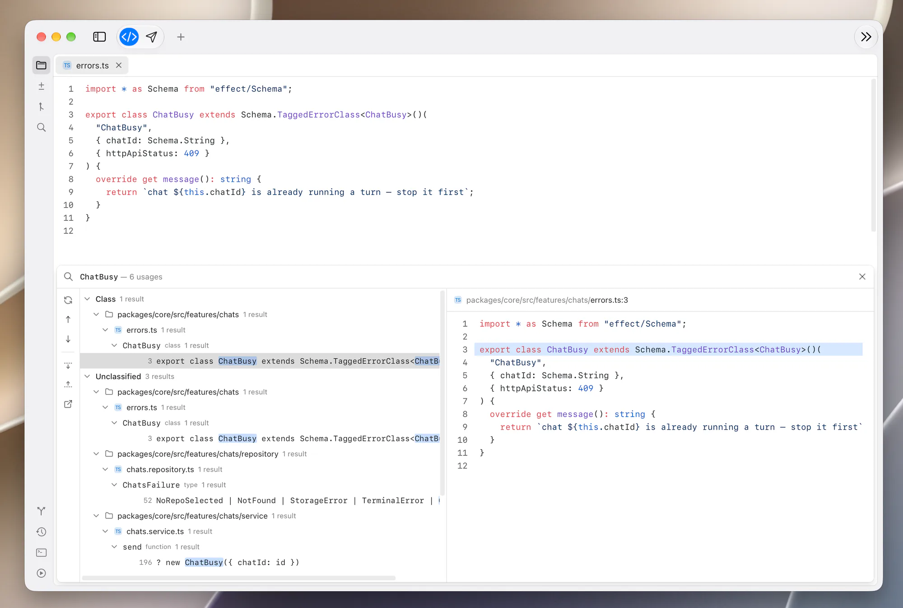

# Reviewer

Mac app for understanding, editing and reviewing code manually or with agents.

<picture>
  <source media="(prefers-color-scheme: dark)" srcset="docs/screenshot-dark.webp">
  
</picture>

The native shell lives in `packages/mac-os`; `pnpm dev` runs the API server
and the SPA it hosts, `pnpm dev:mac` builds and opens the app.

## Resolving review comments with an agent

Comments you leave in Reviewer can be handed to any coding agent (Claude Code,
Codex, Cursor, OpenCode, …) through the
[`resolve-reviewer-comments`](skills/resolve-reviewer-comments/SKILL.md) skill.
It reads the agent's repository's comments from Reviewer's local API server,
implements them and resolves them one by one.

```bash
npx skills add Darna-Digital/reviewer --skill resolve-reviewer-comments
```

Then, with Reviewer running, ask the agent to "resolve my reviewer comments".

## Releasing

Releases are built, signed, notarized and published by GitHub Actions when a
version bump lands on `main` — see [RELEASING.md](RELEASING.md).
